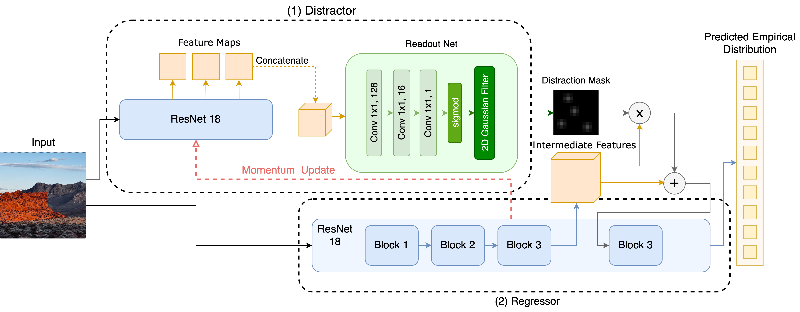

# Intro
This is the model part of the Adversarial Saliency Aware Image Aesthetic Assessment (ASAIAA) project.

# Usage
## Wandb
This project is hosted on [Wandb](https://wandb.ai/542proj). To use it, you need to [sign up](https://wandb.ai/signup) and [create an API key](https://wandb.ai/settings/api).
Then, you can set up you API key with the following command:
```
wandb login
```
## Requirements
This project requires the following packages:
- [torch](https://pytorch.org/)
- [torchvision](https://pytorch.org/docs/stable/torchvision/)
- [pathlib2](https://pypi.org/project/pathlib2/)
- [configargparse](https://pypi.org/project/configargparse/)
- [numpy](https://pypi.org/project/numpy/)
- [einops](https://pypi.org/project/einops/)
- [kornia](https://pypi.org/project/kornia/)
